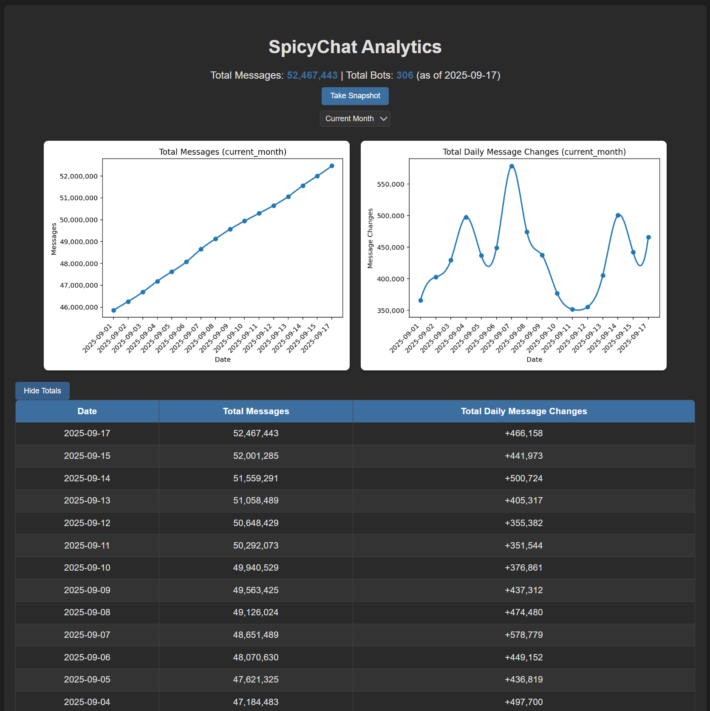
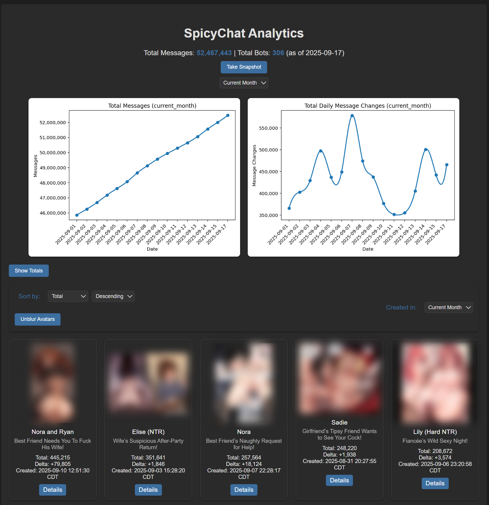
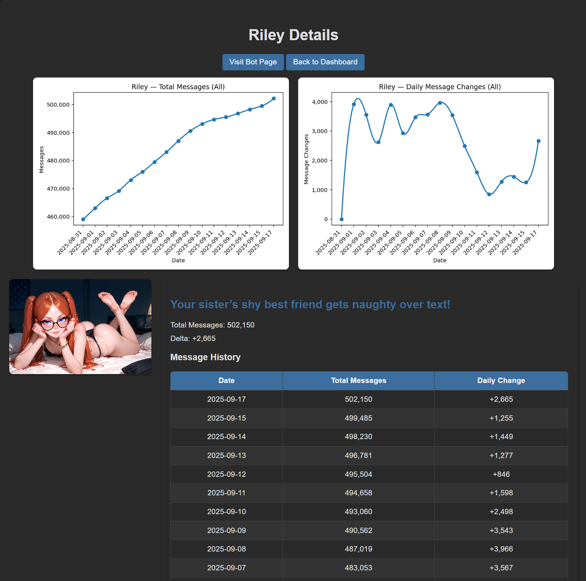

# SpicyChat Analytics Dashboard

This repository contains the SpicyChat Analytics Dashboard, a tool to track and visualize chatbot metrics from SpicyChat.AI. It provides a web interface to display bot statistics, including total messages, daily changes, and historical data, with charts for overall trends and individual bots.

## Prerequisites

- Python 3.11or later (`python --version` to check)
- Internet connection for installing dependencies and accessing the SpicyChat API
- Google account for SpicyChat login

## Setup Instructions

1. **Create Project Directory**
   - Clone this repository to your local machine or download the files manually:
     ```
     git clone https://github.com/IxalonDarkstone/spicychat-analytics-dashboard.git
     cd spicychat-analytics-dashboard
     ```

2. **Run the Setup Script**
   - Run the setup script to install dependencies and create necessary directories:
     ```
     python setup_spicychat.py
     ```
   - This will:
     - Install required Python packages (`flask`, `requests`, `pandas`, `numpy`, `matplotlib`, `scipy`, `playwright`).
     - Install the Playwright Chromium browser.
     - Create directories (`data`, `logs`, `charts`, `static/charts`, `templates`).
     - Initialize the SQLite database (`data/spicychat.db`).

3. **Start the Dashboard**
   - In the same terminal, run the dashboard:
     ```
     python spicychat_analytics.py
     ```
   - An initial snapshot will be taken and you will see charts generated for totals plus each bot.
   - You will need to authenticate the first time you run which will prompt you to login to SpicyChat. You must use the email authentication to receive a code to login as the other methods will not work for the playwright browser. Just enter your email address associated with your SC account then grab the 6 digit code from your email and type it in to authenticate. Navigate to "My Chatbots," and press Enter in the terminal to capture credentials. This captures your auth token and user id to allow the script to pull your bots (Note: This will pull all bots under my-chatbots, even private ones). All of the downloaded data is stored locally. Feel free to browse through the code in github and you will see this is a local only dashboard. You will likely have to auth every 24 hours as SC rotates these values. If they ever have an API approach then I will incorporate that for a more seamless experience.
   - The dashboard will start and be accessible at `http://localhost:5000`.


4. **Take Subsequent Snapshots**
   - Open a web browser and go to `http://localhost:5000`.
   - Click the "Take Snapshot" button.
   - If a valid credentials exist, it will use that to take the snapshot. If it has expired, a browser window will open to `https://spicychat.ai` and you can login as described above.
   - After logging in with your Google account, navigate to "My Chatbots," and then press Enter in the terminal (before closing the browser which will be done automatically) to capture credentials and create the snapshot.
   - The dashboard will display the new bot table, charts, and Totals history.

## Directory Structure

After setup completes, the directory structure will look like this:

```
spicychat-analytics-dashboard/
├── spicychat_analytics.py
├── setup_spicychat.py
├── data/
│   ├── spicychat.db
│   ├── auth_credentials.json (created after login)
├── logs/
│   ├── spicychat.log
│   ├── setup_spicychat.log
├── charts/
├── static/
│   ├── styles.css
│   ├── charts/
├── templates/
│   ├── index.html
│   ├── bots_table.html
│   ├── bot.html
```

## Features

- **Main Page Charts**: Visualize total messages and daily changes for 7-day, 30-day, Current Month, and All timeframes. 7 Days Default.
- **Bot Cards/Detail Pages**: View bot cards for each of your bots with avatars and individual bot metrics and charts using the Details button on the card (All timeframe).
- **Bot Table Sorting**: Sort by Delta Δ, Total, Created At, or Name, Ascending or Descending. Default is Delta Δ Descending.
- **Creation Timeframe Scoping**: Choose the Created in: dropdown to see only bots created during the selected timeframe (All, 7 Days, 30 Days, Current Month). Defaults to All.
- **Persistent Totals History**: Collapsible history table, expanded by default, persists state during the session.
- **Authentication**: Uses `auth_credentials.json` to store credentials, with browser-based login for initial setup or expired tokens.
- **Additional Features**: Correct daily deltas, dark theme, total bots display, snapshot button.
- **Opening SpicyChat Bots**: You can open any specific bot in a new tab by clicking the avatar image on the main page or the Visit Bot Page button on the Bot Details page.
- **Standalone Date Removal Script**: If SpicyChat ever goes down and no messages are received (eg. this happened on 9/16/25) you can use the clean_database_data.py file in the main directory to remove a specific date. I recommend taking a backup of the database located at data\spicychat.db before running this script. Use the syntax below to remove a specific date (the example shows what I ran on 9/17 to remove data from 9/16) from the database.
```
python clean_database_data.py 09/16/2025
```

## Screenshots

- **Main Page with Totals History**


- **Main Page with Totals History Hidden and Bot Cards**


- **Bot Details Page**



## Troubleshooting

- **Setup Issues**: If the setup script fails, ensure Python 3.11+ is installed (`python --version`) and you have internet access.
- **Log Files**: Check `logs/setup_spicychat.log` for setup errors or `logs/spicychat.log` for runtime issues.
- **Snapshot Issues**: Ensure you complete the Google Sign-In and navigate to "My Chatbots" before pressing Enter in the terminal.
- **Chart Issues**: Verify `charts/` and `static/charts/` are writable. Test without chart generation to isolate issues:
  ```
  python spicychat_analytics.py --no-charts
  ```

## Notes

- The dashboard requires a valid SpicyChat account for data access.
- Charts for new bots (created on or after a specific date) are generated automatically during snapshots.
- The dashboard runs locally and stores data in a SQLite database (`data/spicychat.db`).


If you have any thoughts on what could be better or more useful, please feel free to DM me on Discord @Ixalon
