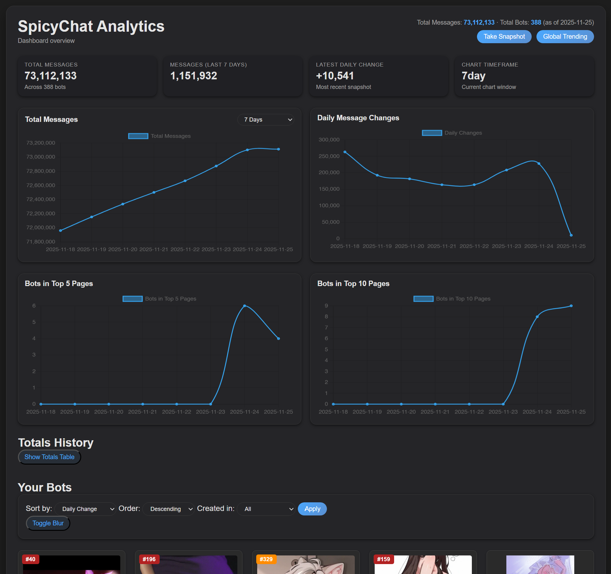
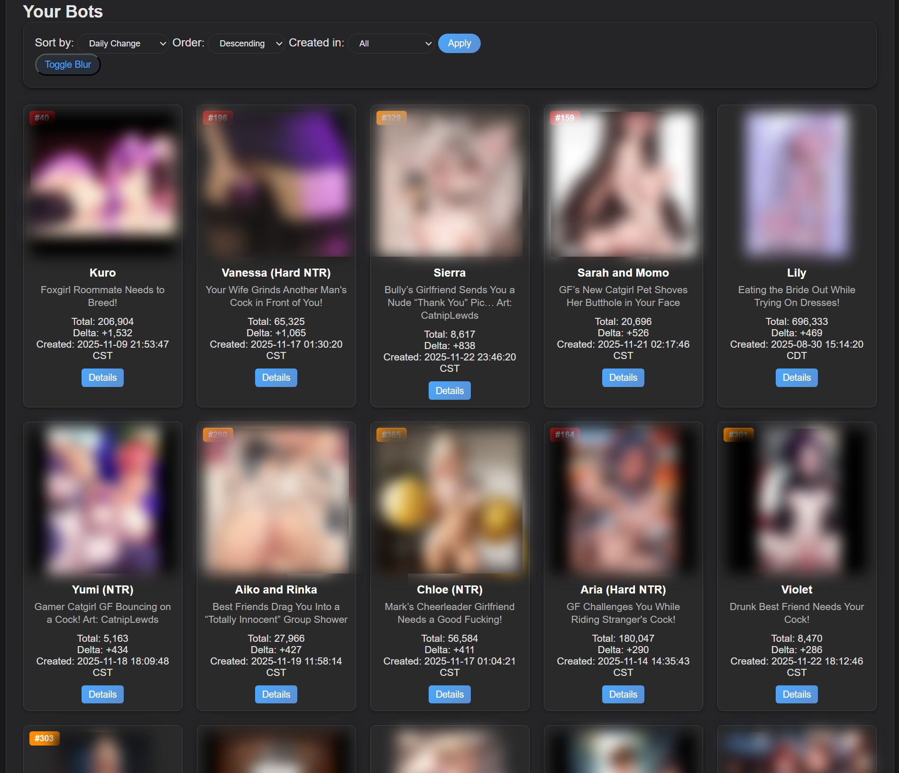
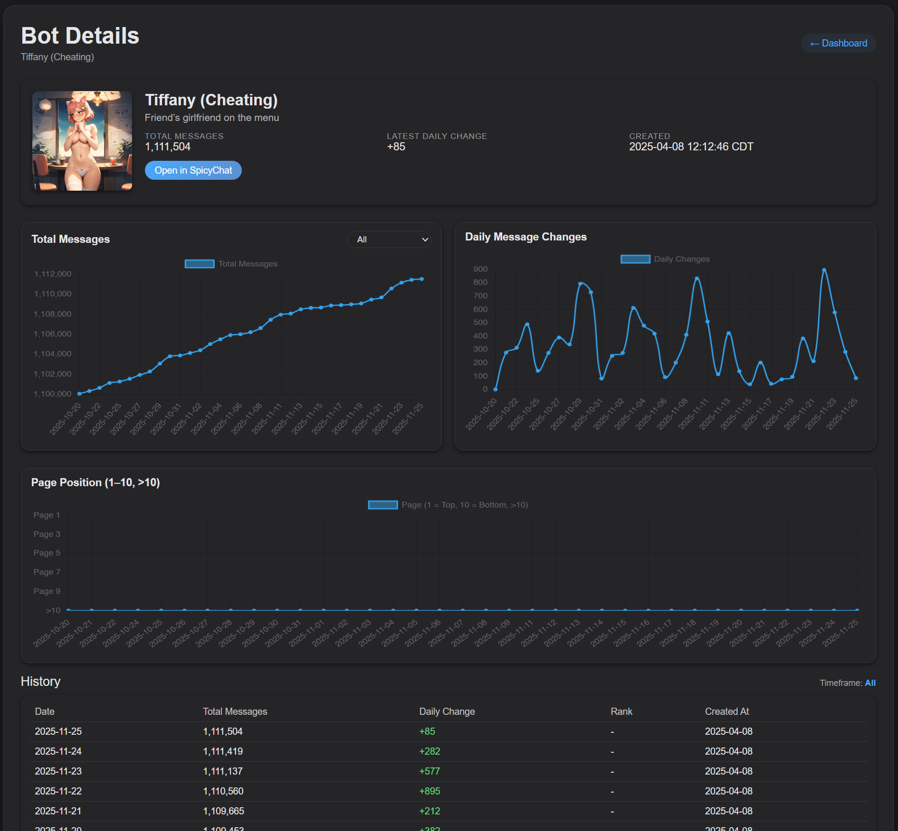
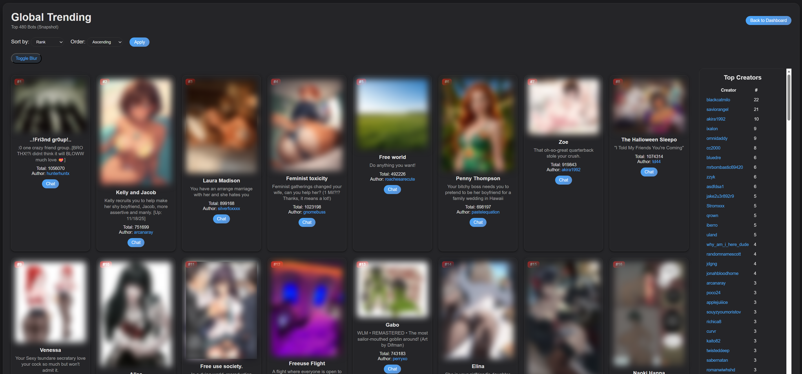
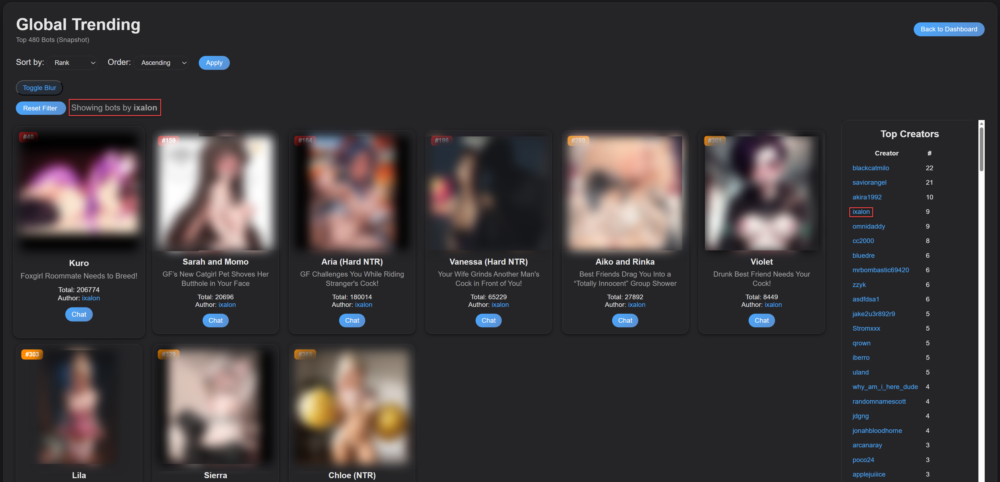

# SpicyChat Analytics Dashboard

Welcome to the SpicyChat Analytics Dashboard — a local, private, fully-featured tool for tracking how your SpicyChat bots are performing over time.  

If you’ve ever wished SpicyChat had a real analytics page… this dashboard is exactly that. It pulls all your bot stats, generates charts, tracks daily growth, shows trending data, and gives you a clean, modern interface to explore everything.

Everything runs 100% locally on your machine. Nothing is uploaded or shared anywhere.

---

# 🧰 What This Dashboard Does

Here’s the fun part — this thing has grown into a *real* analytics suite:

### 📊 **Main Dashboard**
- Total messages & daily deltas
- Timeframe charts (7 days, 30 days, current month, all time)
- Dark-mode, smooth gradient charts
- Quick snapshot button
- Creation date filtering

### 🧩 **Bot Cards**
- Avatar, name, title, totals, deltas
- “Details” button that opens a full history page
- Click avatar → opens bot directly on SpicyChat

### 📈 **Bot Detail Pages**
- Historical charts for each bot
- Metadata + creation date
- Quick link to open the bot

### 🔥 **Global Trending (New!)**
This is the biggest addition yet.

- Full Top-480 trending feed from SpicyChat (pages 1–10)
- Accurate ranks (#1–480)
- Rank badge colors (Top 240 = red, Top 480 = orange)
- Sorting by Rank, Messages, Author
- Pagination (48 per page)

### 🧭 **Author Sidebar**
- Full creator leaderboard
- Shows who has the most bots in Top 480
- Clicking a creator filters the trending list to *only* their bots
- Reset Filter button to go back

### 🖼 **Responsive Layout**
- Cards stretch across ~95% of your window
- Sidebar stays on the right and scrolls independently
- Looks great on large monitors, laptops, even 1080p screens

### 💾 **Local Database + Snapshots**
Each day you run a snapshot, the dashboard stores:

- Each bot’s totals  
- Daily deltas  
- Rank history  
- How many of your bots hit Top 240 and Top 480  
- Trending page numbers  
- All historical charts  

All inside a simple SQLite file.

### 🔐 **Authentication**
- Playwright pops open a secure browser tab
- You log in normally using **email code login**  
- Navigate to “My Chatbots”
- Press Enter in the terminal to capture auth
- Tokens expire every ~24 hours → dashboard will re-prompt

Everything stays local and goes into `auth_credentials.json`.

---

# 🛠 Installation

You now have **two** easy install paths: one-click or manual.

---
## 🟩 Clone the repo

```bash
git clone https://github.com/IxalonDarkstone/spicychat-analytics-dashboard.git
cd spicychat-analytics-dashboard
```

Then run one of the options below:

## 🟦 One-Click Windows Install (Easiest)

Just double-click:

```
install_spicychat.bat
```

It will:

- Install Python dependencies  
- Install Playwright browsers  
- Create all necessary directories  
- Initialize the database  
- Prepare everything for first run  

That’s it.

---

## 🟧 Manual Setup (Any OS)

```bash
python setup_spicychat.py
```

This creates all folders, installs Playwright, initializes the database, etc.

---

# ▶️ Running the Dashboard

Start the app:

```bash
python spicychat_analytics.py
```

### On first run:
- A browser opens to SpicyChat  
- Enter your email → type the 6-digit code  
- Navigate to **My Chatbots**
- Go back to terminal → press ENTER  
- The dashboard captures your token and runs the initial snapshot  

Then open:

```
http://localhost:5000
```

You’ll see your full analytics dashboard.

---

# 📁 Folder Layout

After setup and first run:

```
spicychat-analytics-dashboard/
├── spicychat_analytics.py
├── setup_spicychat.py
├── install_spicychat.bat
│
├── data/
│   ├── spicychat.db
│   ├── auth_credentials.json
│   ├── public_bots_home_all.json
│
├── logs/
│   ├── spicychat.log
│   ├── setup.log
│
├── charts/
│   ├── totals_*.png
│   ├── bot_*.png
│
├── static/
│   ├── style.css
│   ├── charts/
│
└── templates/
    ├── index.html
    ├── bots_table.html
    ├── bot_detail.html
    ├── global_trending.html
```

---

# 📸 Screenshots  

### **Main Dashboard Overview**


### **Bot Cards Grid**


### **Bot Detail Page**


### **Global Trending Explorer**


### **Creator Sidebar Filter**


---

# 🧹 Fixing Bad Snapshot Data

If SpicyChat goes down and gives you a zero-message day, remove it:

```bash
python clean_database_data.py 09/16/2025
```

(Always back up the DB first.)

---

# ❓ Troubleshooting

### Browser doesn’t open
Run:
```
python -m playwright install
```

### Snapshot fails
Delete:
```
data/auth_credentials.json
```
Run again.

### Templates missing  
Make sure you have:
```
templates/index.html
templates/bots_table.html
templates/bot_detail.html
templates/global_trending.html
```

### Charts missing  
Ensure folders exist and are writable:
```
charts/
static/charts/
```

---

# 💬 Questions / Suggestions?

Feel free to DM me on Discord: **@Ixalon**

Always happy to improve this tool or help debug an issue.

